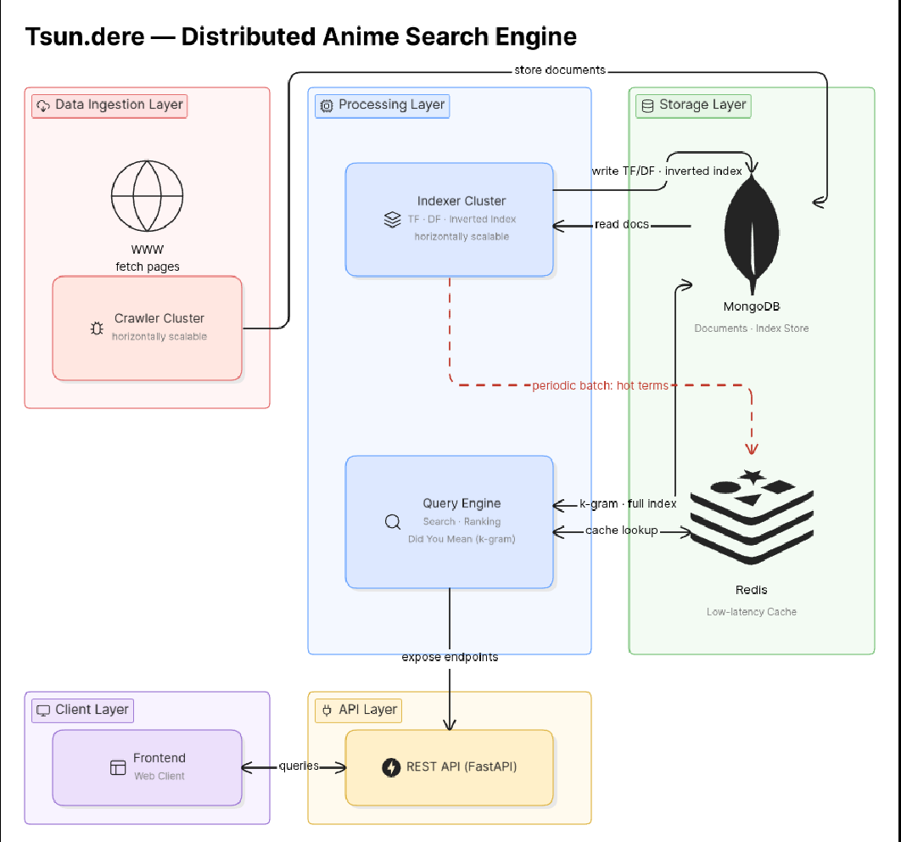
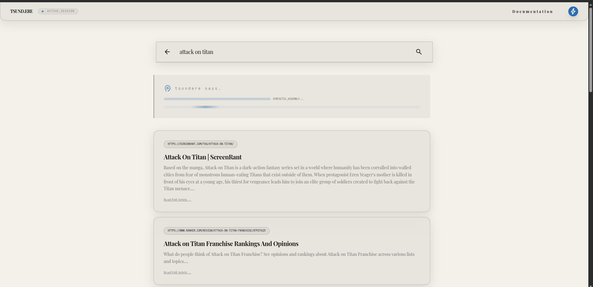
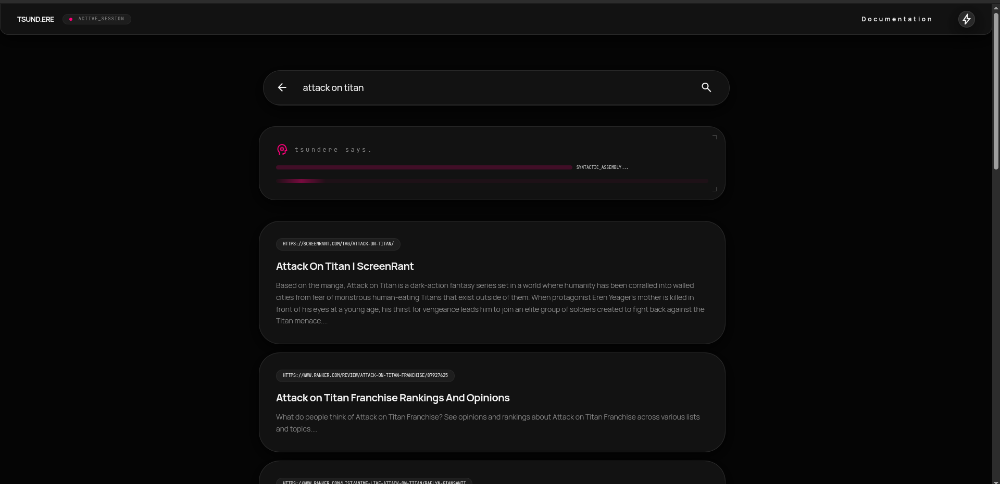

# Tsun.dere — Anime Search Engine

A high-performance anime-focused search engine with intelligent ranking, semantic-aware scoring, and low-latency query handling.

---

## Architecture

---
## UI Preview

### Light Mode



### Dark Mode



---

## Features

* **BM25-based Search Ranking**
* **Redis Caching for Frequent Queries**
* **Custom Semantic Scoring**
* **"Did You Mean" via K-Gram Indexing**
* **FastAPI-based Search API**
* Optimized for anime-related content and metadata

---

## How It Works

### 1. Indexing Pipeline

* Documents are crawled and processed into a structured format.
* Tokenization + normalization applied.
* Indexed using **BM25 (Best Matching 25)** for relevance scoring.

---

### 2. Query Processing Flow

```text
User Query → Preprocessing → Spell Correction → Cache Check → BM25 Retrieval → Custom Scoring → Results
```

---

### 3. BM25 Ranking

* Core retrieval uses BM25 scoring:

  * Term Frequency (TF)
  * Inverse Document Frequency (IDF)
  * Document Length Normalization

* Ensures strong baseline relevance.

---

### 4. Redis Caching Layer

* Frequently searched queries are cached in **Redis**.
* Reduces latency for hot queries from ~O(retrieval) → ~O(1).
* Cache invalidation handled on index updates.

---

### 5. Custom Semantic Scoring

To improve relevance beyond BM25:

* **Weighted term positions:**

  * Title matches > Description > Tags
* **Phrase proximity boosts**
* **Query term importance adjustment**

This improves semantic alignment with user intent instead of pure keyword matching.

---

### 6. "Did You Mean" (Spell Correction)

* Implemented using **K-Gram Indexing**
* Steps:

  1. Break words into k-grams (e.g., trigrams)
  2. Find candidate terms via overlap
  3. Rank using edit distance

Example:

```text
Input: "narutoo"
Suggestion: "naruto"
```

---

### 7. FastAPI Backend

* High-performance REST API built using **FastAPI**
* Endpoint:

```http
GET /search?q=<query>
```

* Returns:

  * Ranked results
  * Optional corrected query
  * Metadata (scores, relevance)

---

## Tech Stack

* **Backend:** FastAPI (Python)
* **Search Engine:** BM25 (custom implementation)
* **Caching:** Redis
* **Database:** MongoDB
* **Spell Correction:** K-Gram + Edit Distance
* **Frontend:** (Add your stack here, e.g., React / Vanilla JS)

---

## Performance Highlights

* Sub-100ms response for cached queries
* Reduced redundant computation via Redis
* Improved relevance using hybrid scoring (BM25 + semantic boosts)

---

## Future Improvements

* Personalized recommendations
* Anime embedding-based semantic search (vector search)
* Incremental indexing
* Query auto-suggestions

---

## Inspiration

Built to explore:

* Information Retrieval systems
* Low-latency backend design
* Search relevance optimization

---

## Running the Crawler

Follow these steps to collect and populate anime-related data:

### 1. Install MongoDB

Ensure MongoDB is installed and running locally:

```bash
sudo systemctl start mongod
```

---

### 2. Seed Initial URLs

Populate the database with initial seed URLs:

```bash
python add_dummy_data.py
```

* Inserts starter links into MongoDB
* Acts as entry points for the crawler

---

### 3. Run the Crawler

Start the main crawler:

```bash
python spider/fancy_crawler.py
```

* Recursively fetches and parses anime-related content
* Stores structured documents into MongoDB
* Designed for extensibility and domain-specific parsing

---

### Source-Specific Scrapers

Dedicated scraping scripts are implemented for:

* **comix.to**
* **mangadex**
* **reddit**

These were built by analyzing and leveraging their respective APIs to ensure:

* Structured and reliable data extraction
* Reduced parsing overhead compared to raw HTML scraping
* Better rate-limit handling and consistency

---

## Running the Indexer

After data collection, build the search index:

```bash
python indexer/parser.py
```

### What it does:

* Parses stored documents from MongoDB
* Performs tokenization and normalization
* Builds BM25-compatible index structures
* Prepares auxiliary data (e.g., k-grams for spell correction)

---

This separation ensures a clean pipeline:

```text
Crawler → MongoDB → Indexer → Search API
```
